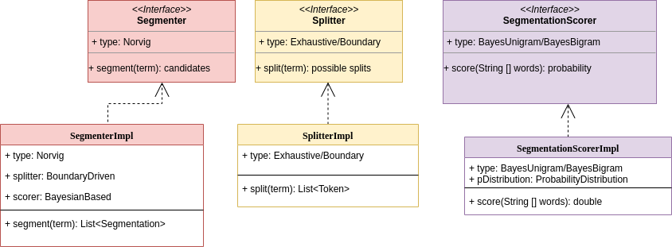

<!--
Licensed to Dent-in Tech Solutions under one or more
contributor license agreements. See the NOTICE file distributed with
this work for additional information regarding copyright ownership.
Dent-in Tech Solutions licenses this file to You under the Apache License, Version 2.0
(the "License"); you may not use this file except in compliance with
the License. You may obtain a copy of the License at

    http://www.apache.org/licenses/LICENSE-2.0

Unless required by applicable law or agreed to in writing, software
distributed under the License is distributed on an "AS IS" BASIS,
WITHOUT WARRANTIES OR CONDITIONS OF ANY KIND, either express or implied.
See the License for the specific language governing permissions and
limitations under the License.
-->

Probabilistic Word Segmentation in Java
===========

This is effectively our own Java implementation of
Peter Norvig's Word Segmentation algorithm described in his
chapter Natural Language Corpus Data from the book Beautiful Data (https://norvig.com/ngrams/).

## Design in Diagrams

In our design we have kept the splitting, segmentation and scoring of split candidates
separate, each in its own component. This allows for different splitting algorithms - e.g., exhaustive by splitting on each character or boundary-based
where boundaries can be the offsets of dictionary terms identified therein by algorithms such as Aho-Corasick's -
 or the scoring of split candidates - e.g., by using a probabilistic language model or any other scoring model trained by supervised learning -
 or even the actual segmentation algorithm - e.g., recursive or non-recursive - to be plugged in easily. See a visual abstraction
 of the three components in the following class diagram of the Word Segmenter:



A general template for a Lexicon API is illustrated below from which the word segmenter only uses the ProbabilityDistribution class in package pdist:


And finally a more foundational component, a class diagram of the Tokenizer used by the word segmenter:


All of the above diagrams were produced using https://www.draw.io/.

## Building the library

Tested with JDK 12.0.2 and Maven 3.6.0 on Linux 5.0.0-36-generic.

After cloning the repository go into the destination directory and run:

```
mvn install
```

### Usage

#### Word Segmenter
```java

//no need for corpus lexicon in the splitter (i.e., 2nd parameter)
Splitter splitter = new SegmenterFactory().createSplitter(Splitter.type.EXHAUSTIVE, null);
SegmentationScorer scorer = new SegmenterFactory().createSegmentationScorer(unigramDataFileName, bigramDataFileName, totalNumberOfTokens, SegmentationScorer.type.BAYES_UNIGRAM);
Segmenter segmenter = new SegmenterFactory().createSegmenter(Segmenter.type.NORVIG, splitter, scorer);
```

Please see class SegmenterTest for more examples on usage.


## Contributing

If you would like to contribute code, please send an email to mkabadjov @ yahoo.co.uk.


